# 🏛️ Campus Digital Twin & Prescriptive Load-Balancing AI Copilot

[](LICENSE)
[](https://www.python.org/)
[](https://fastapi.tiangolo.com/)
[-purple.svg)](https://ollama.com/)

> **A real-time 5-Layer Campus Digital Twin system that models student mobility across 12 facilities, predicts 15-minute slot capacity up to 24 hours ahead, automatically load-balances student schedules when congestion triggers occur, and provides a 100% locally deployed IBM Granite RAG AI Copilot.**

---

## 🌟 Key Features

* **🏛️ 12-Venue Digital Twin Engine**: Real-time capacity monitoring and 3-second live telemetry polling across libraries, computer labs, cafeterias, gymnasiums, and student centers.
* **📈 7-Step ML Forecasting & True Demand Reconstruction**: Uses Holt-Winters exponential smoothing and corrects for capacity capping and reroute spillover ($\text{Demand}_{\text{true}} = \text{Occupancy}_{\text{observed}} + \text{Rerouted}_{\text{away}}$).
* **⚡ Prescriptive Load-Balancing**: Detects $\ge 85\%$ congestion peaks and automatically re-aligns student daily schedules to underutilized alternatives, saving students **160+ minutes of waiting time daily**.
* **🤖 100% Local IBM Granite RAG Copilot**: Answers natural queries using FAISS vector indexing, Ollama VRAM model pinning, and dynamic intent routing across time-specific, peak congestion, operating hours, cause/anomaly, and personal schedule queries.
* **🔑 Multi-Student Login & Telemetry Sync**: Quick-switch demo student portal (`u_0042`, `u_0007`, `u_0004`, `u_0010`) that dynamically syncs personal schedules, load-balance scores, self check-in events, and copilot answers.
* **🚨 Ground-Truth Anomaly Injection**: Simulates exam weeks, cultural fests, infrastructure outages, and class cancellations to stress-test real-time adaptive rerouting.

---

## 🏗️ 5-Layer System Architecture

```mermaid
flowchart TD
    subgraph Layer0["Layer 0: Data & Synthetic Ingestion Stream"]
        DB[("SQLite DB: campus_twin.db")]
        GenSnap["daily_snapshots_gen.py (360 Days)"]
        CheckinAPI["POST /api/ingest/checkin (Live Stream)"]
    end

    subgraph Layer1["Layer 1: Sensor & Aggregation Engine"]
        WifiData["Wi-Fi / Turnstile Telemetry"]
        Aggregator["15-Min Bucket Aggregator"]
    end

    subgraph Layer2["Layer 2: 7-Step ML Forecasting Engine"]
        HWModel["Holt-Winters Exponential Smoothing"]
        TrueDemand["Demand Reconstruction: D_true = O_obs + D_spill"]
        Anomalies["Ground Truth Anomaly Injector"]
    end

    subgraph Layer3["Layer 3: Load Balancer & Personalization Engine"]
        UserProfiles["1,500 Simulated Student Profiles"]
        GreedyLB["Greedy Load Balancer (85% Threshold)"]
        DaySchedule["Personal Day Schedule Optimizer"]
    end

    subgraph Layer4["Layer 4: Local RAG Copilot & Intent Router"]
        FAISS["FAISS Vector DB (480 Embeddings)"]
        GraniteEmbed["IBM Granite 278M Embedding Model"]
        OllamaGranite["IBM Granite 3.1 8B LLM (Ollama Local)"]
        IntentRouter["5-Intent Dynamic Query Router"]
    end

    subgraph UI["Frontend UI (demo.html)"]
        TwinGrid["12-Venue Digital Twin Grid"]
        ScheduleModal["Interactive Personal Schedule Viewer"]
        CopilotChat["Live Granite RAG Chat Panel"]
        LoginModal["Student Portal Login & User Sync"]
    end

    Layer0 --> Layer1
    Layer1 --> Layer2
    Layer2 --> Layer3
    Layer3 --> Layer4
    Layer4 --> UI
```



---

## 🚀 Quick Start Guide

### Prerequisites
* **Python**: 3.11 or higher
* **Ollama**: Download and install from [ollama.com](https://ollama.com/)

---

### Step 1: Clone the Repository & Install Dependencies
```bash
git clone https://github.com/takeitezybaby/hackverse.git
cd hackverse
pip install -r requirements.txt
```

---

### Step 2: Pull Local IBM Granite AI Models
Start the Ollama daemon and pull the embedding and LLM models:
```bash
# In a separate terminal
ollama serve

# Pull models (IBM Granite 278M Embeddings + Granite 3.1 8B Dense LLM)
ollama pull granite-embedding:278m
ollama pull granite3.1-dense:8b
```

---

### Step 3: Run One-Time System Initialization
Run `setup.py` to generate synthetic mobility datasets, seed the SQLite database (`data/campus_twin.db`), cache forecasts, and build the FAISS vector index:
```bash
python setup.py
```

---

### Step 4: Launch the System

#### Windows Quick Launch:
```cmd
run_demo_mode.bat
```

#### Manual Launch:
```bash
# Terminal 1: Launch FastAPI Backend Server
python -m app.main
# Server runs on http://127.0.0.1:8000

# Terminal 2: Launch Frontend Web UI
python -m http.server 5173 --directory frontend
# Open browser at http://127.0.0.1:5173/demo.html
```

---

## 🔌 API Endpoints Summary

| Endpoint | Method | Description |
| :--- | :---: | :--- |
| `/api/forecast-frontend` | `GET` | Returns live occupancy readings, forecast curves, and status for all 12 venues. |
| `/api/report/daily/{user_id}` | `GET` | Returns Layer 3 load-balancing score, personalized itinerary, and daily summary for a student. |
| `/api/schedule/personalized/{user_id}` | `GET` | Returns itemized timeline shift recommendations and wait-time savings. |
| `/api/ask` | `POST` | RAG Copilot query endpoint powered by IBM Granite 3.1 & FAISS similarity search. |
| `/api/ingest/checkin` | `POST` | Ingests live student check-in events and updates venue telemetry in real time. |
| `/api/events/ground-truth` | `GET` | Fetches active simulated ground-truth anomaly events (exams, fests, outages). |

---

## 📁 Repository Layout

```
hackverse/
├── app/
│   ├── contracts.py          # Shared data contracts, schemas, and resource constants
│   ├── main.py               # FastAPI application entry point & CORS configuration
│   ├── db/                   # SQLite database initialization & seeding
│   ├── api/                  # REST API routes (ingest, forecast, reports, copilot)
│   ├── twin/                 # Layer 1 & 2 Digital Twin state & 7-step forecasting engine
│   ├── personalization/      # Layer 3 prescriptive load balancer & schedule optimizer
│   ├── llm/                  # Layer 4 Ollama IBM Granite LLM client & intent router
│   └── rag/                  # Layer 4 FAISS embedding indexer & vector retriever
├── frontend/                 # Single-page web dashboard (Vanilla JS, Tailwind CSS, Chart.js)
│   └── demo.html
├── data_gen/                 # Layer 0 synthetic data generators (snapshots, users, checkins)
├── data/                     # Generated SQLite DB & vector indices (gitignored)
├── setup.py                  # One-time pipeline initialization script
├── requirements.txt          # Pinned Python dependencies
└── LICENSE                   # MIT License
```

---

## 📜 License

Distributed under the MIT License. See [`LICENSE`](LICENSE) for more details.
